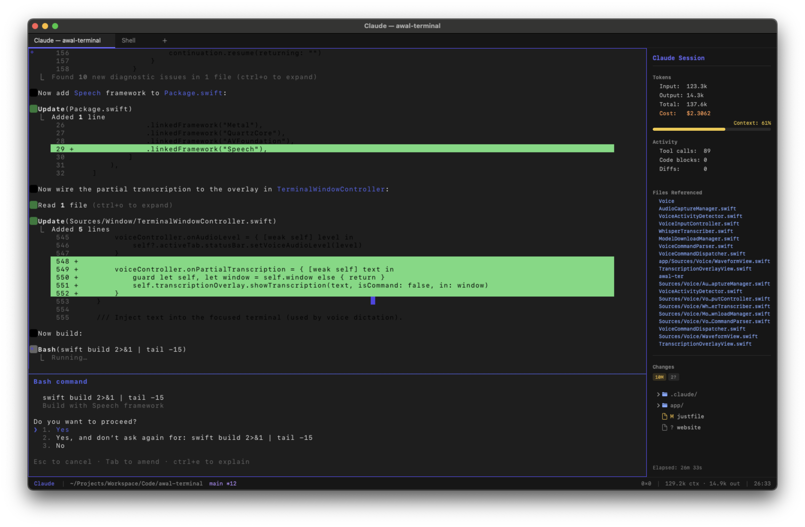

<p align="center">
  
</p>

<h1 align="center">Awal Terminal</h1>

<p align="center">
  The LLM-native terminal emulator for macOS.<br>
  Built for developers who work with AI coding agents.
</p>

<p align="center">
  <a href="https://awalterminal.github.io/Awal-terminal/">Website</a> &middot;
  <a href="https://github.com/AwalTerminal/Awal-terminal/releases/latest/download/AwalTerminal.zip">Download</a>
</p>

---

## What is Awal Terminal?

A native macOS terminal built from scratch with Swift and Rust, designed specifically for working with AI coding agents like Claude Code, Gemini CLI, and Codex CLI.

<p align="center">
  
</p>

## Features

| Feature | Description |
|---|---|
| GPU-Accelerated Rendering | Metal-powered rendering at 120fps with a glyph atlas and triple buffering. 10,000-line scrollback buffer |
| LLM Profiles | Switch between Claude, Gemini, Codex, or plain shell in one click. Save per-model configurations |
| AI Side Panel | Track token usage, costs, context window, file references, and git changes in real time |
| Smart Output Folding | AI tool calls, code blocks, and diffs auto-collapse into foldable regions. Click to expand |
| Voice Input | Push-to-talk voice input powered by on-device speech recognition. Continuous and wake word modes coming soon |
| AI Components | Auto-detect your project stack and inject skills, rules, prompts, agents, MCP servers, and hooks into AI sessions from shared registries. Supports git, [localskills](https://localskills.dev), and local directory sources. Per-component enable/disable, security scanning, hook approval gate, and import/export |
| Sub-Stack Detection | Automatically detects frameworks like Next.js, Django, Flask, Vapor, NestJS, and more on top of base stack detection for more targeted component injection |
| Resume Sessions | Browse and resume past AI sessions from the startup menu. Claude sessions show turn count and time ago; Codex and Gemini launch their built-in session pickers |
| Smart Notifications | Desktop alerts when long-running AI tasks complete |
| Tabs & Splits | Native tabs with drag-to-reorder, custom tab colors, and per-tab titles. Split panes (vertical and horizontal) are temporarily disabled while a rendering bug is being resolved |
| Quick Terminal | Quake-style dropdown terminal with a global hotkey (`Ctrl+``) |
| Find in Terminal | Search through scrollback with match highlighting and keyboard navigation. OSC 8 hyperlinks and drag-and-drop file pasting |
| Syntax Highlighting | Language-aware coloring for code blocks and diffs inside AI output |
| Git Integration | Live branch, status, and changed files displayed in the status bar and side panel. Click any changed file to view its diff inline. Per-tab worktree isolation for parallel workstreams |
| Large Paste Protection | Confirmation dialog for large pastes with options to save to file, truncate, or paste all. Configurable threshold |
| Danger Mode | Skip all AI tool confirmation prompts for unrestricted sessions. Toggle from the View menu; always resets on app launch |
| Automatic Updates | Checks GitHub Releases for new versions and shows an indicator in the status bar. Supports Homebrew and direct download updates |
| Fully Configurable | Theme colors, fonts, keybindings, and voice settings in a single config file |

## Getting Started

### Install with Homebrew (recommended)

```bash
brew tap AwalTerminal/tap
brew install --cask awal-terminal
```

No quarantine workarounds needed — Homebrew handles it automatically.

### Download manually

Grab the latest build from [GitHub Releases](https://github.com/AwalTerminal/Awal-terminal/releases/latest).

Since the app is not yet notarized with Apple, macOS will block it on first launch. To bypass this:

1. **Right-click** (or Control-click) the app and choose **Open**, then click **Open** in the dialog.

If that doesn't work, run this in Terminal:

```bash
xattr -cr AwalTerminal.app
```

Then open the app normally.

### Build from Source

Requires Rust and Swift toolchains on macOS.

```bash
# Install just (task runner)
brew install just

# Build and run
just run

# Build release .app bundle
just bundle

# Create a new release
scripts/release.sh v0.2.0
```

### Configuration

All settings live in `~/.config/awal/config.toml`:

```toml
[font]
family = "JetBrains Mono"
size = 13.0

[theme]
bg = "#1e1e1e"
fg = "#e5e5e5"
accent = "#636efa"

[voice]
enabled = true
mode = "push_to_talk"
whisper_model = "tiny.en"

[paste]
warning_threshold = 100000
truncate_length = 10000

[tabs]
random_colors = true
# random_color_palette = "#E55353, #3498DB, #27AE60"
confirm_close = true
worktree_isolation = false
# worktree_branch_prefix = "awal/tab"

[quit]
confirm_close = true

[ai_components]
enabled = true
auto_detect = true
auto_sync = true
security_scan = true
require_hook_approval = true

[ai_components.registry.awal-components]
url = "https://github.com/AwalTerminal/awal-ai-components-registry.git"
branch = "main"

[ai_components.registry.my-skill]
type = "localskills"
slugs = "ZpDEwZj1Yq"

[ai_components.registry.my-local]
type = "local"
path = "/path/to/local/registry"
```

## Architecture

```
core/       Rust — terminal emulation, ANSI parsing, AI output analysis
app/        Swift — macOS UI, Metal rendering, voice input, AI side panel
scripts/    Build and release scripts
build/      Release artifacts
docs/       Promotional website (GitHub Pages)
```

## Keybindings

| Action | Shortcut |
|---|---|
| New tab | `Cmd+T` |
| Close tab | `Cmd+W` |
| Split right | `Cmd+D` (coming soon) |
| Split down | `Cmd+Shift+D` (coming soon) |
| Next/prev pane | `Cmd+]` / `Cmd+[` (coming soon) |
| Find | `Cmd+F` |
| AI side panel | `Cmd+Shift+I` |
| Quick terminal | `` Ctrl+` `` |
| Sync AI components | `Cmd+Shift+Y` |
| Voice input (PTT) | `Ctrl+Shift+Space` |
| Preferences | `Cmd+,` |
| Manage AI Components | `Cmd+Shift+M` |

## License

MIT
